# React Component Library - Front-end Test Assessment

## 🎯 Overview

This repository contains a small **React component library** implemented as part of a front-end test assessment.  
The library includes three reusable components with multiple states and props, fully documented and displayed in **Storybook**.

**Tech stack:**

- Next.js
- TypeScript
- TailwindCSS
- Font Awesome
- Framer Motion
- Storybook

---

## 🚀 Components

### 1. Input Component

A smart input field with multiple types, password visibility toggle, and clearable functionality.

**Features:**

- `type="text" | "password" | "number"`
- Password toggle with eye icon
- Clearable input with "X" button

**Storybook Variants:**

- Text input
- Password input (with toggle)
- Number input
- Clearable / non-clearable

**Screenshots:**

- Text Input:  
  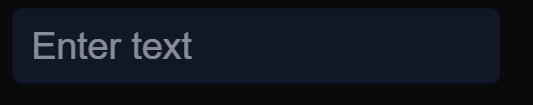
  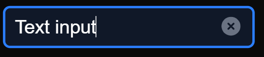

- Password Input (toggle):  
  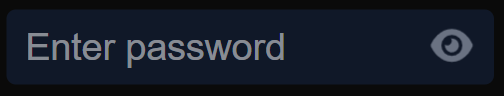
  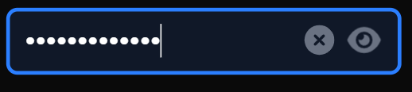

- Number Input:  
  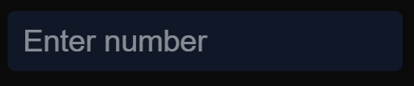
  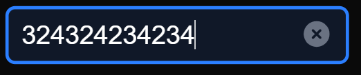

---

### 2. Toast Component

A notification component with sliding/fading animation and auto-dismiss functionality.

**Features:**

- Appears at the bottom-right corner
- Auto-dismiss after a configurable duration
- Optional manual close button
- Animations using **Framer Motion**

**Storybook Variants:**

- Info, Success, Warning, Error types
- Different durations
- Manual close

**Screenshots:**

- Info Toast:  
  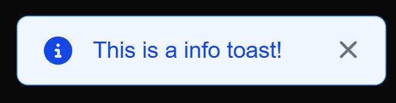

- Success Toast:  
  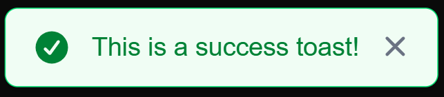

- Error Toast:  
  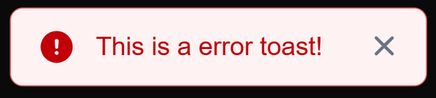

- Warning Toast:  
  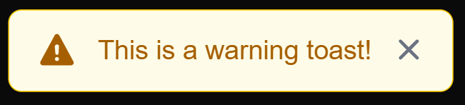

---

### 3. Sidebar Menu Component

A collapsible, nested sidebar menu with sliding animation.

**Features:**

- Slides in from the right
- Nested submenus (1-level / 2-level)
- Closes when clicking outside
- Animations with **Framer Motion**

**Storybook Variants:**

- One-level menu
- Two-level nested menu
- Open / closed states

**Screenshots:**

- One-level menu:  
  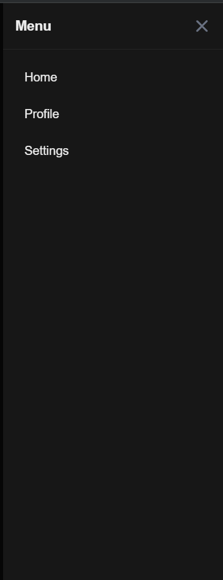

- Two-level menu:  
  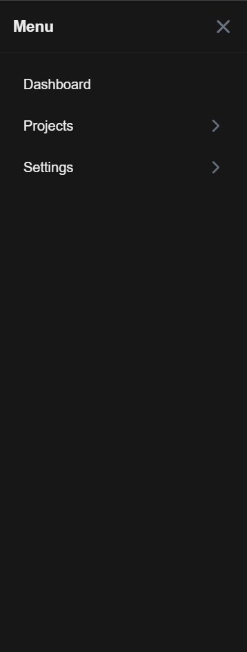

---

## ⚙️ Setup & Usage

### 1. Clone the repository

```bash
git clone https://github.com/your-username/react-component-library.git
cd react-component-library
```

### 2. Install dependencies

```bash
npm install
# or
yarn install
```

### 3. Run Storybook

```bash
npm run storybook
# or
yarn storybook
```

### 4. Build & Run Next.js App (optional)

```bash
npm run dev
# or
yarn dev
```

---

### Development Notes

- All components are functional components using hooks

- Styled with TailwindCSS

- Icons from Font Awesome

- Animations handled with Framer Motion

- Storybook includes controls for interactive props editing
